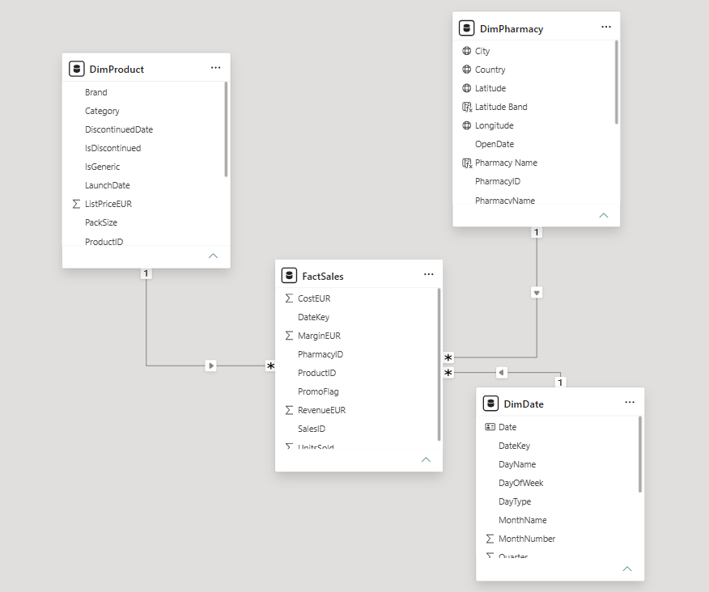
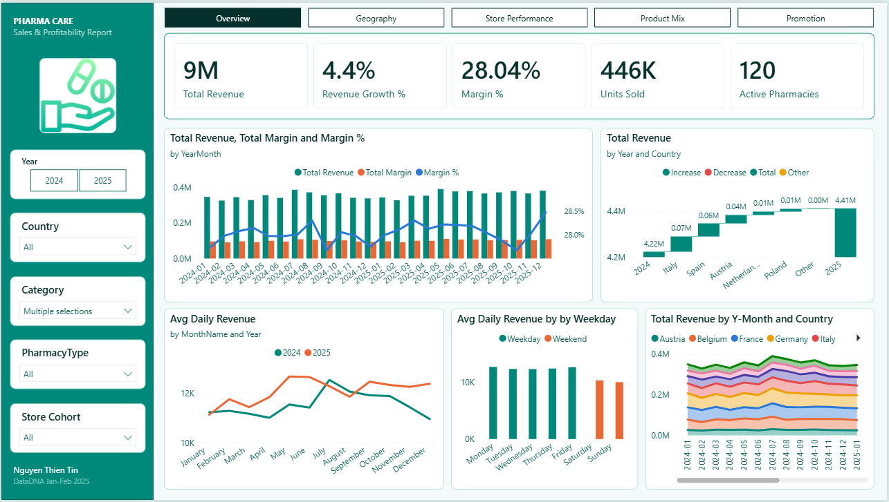
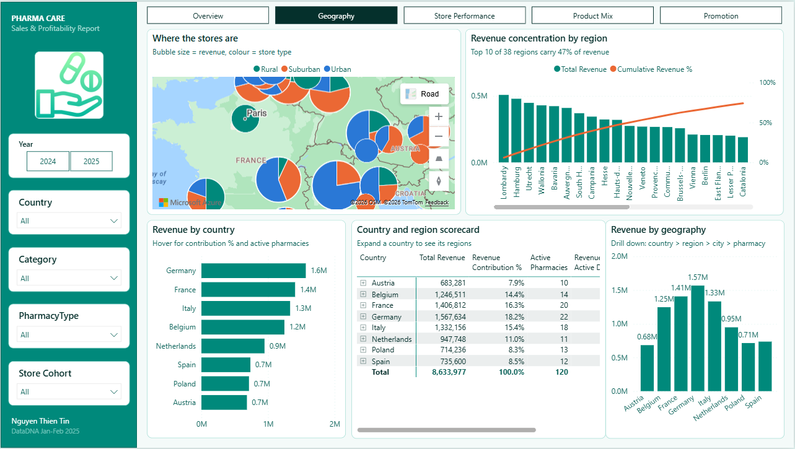
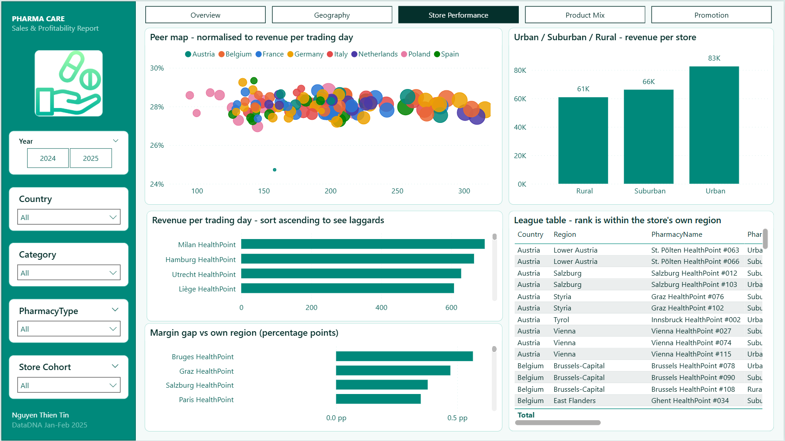
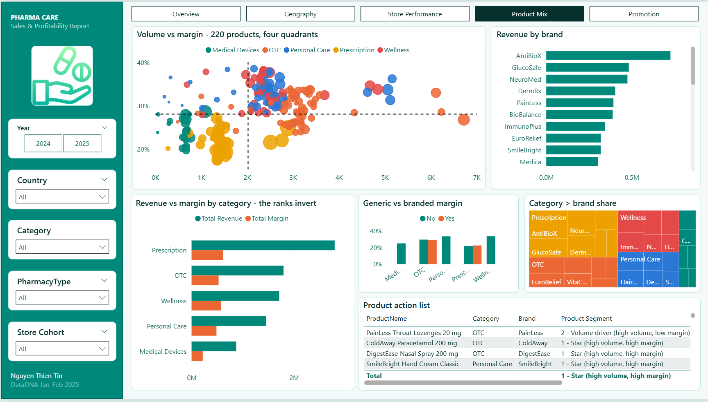
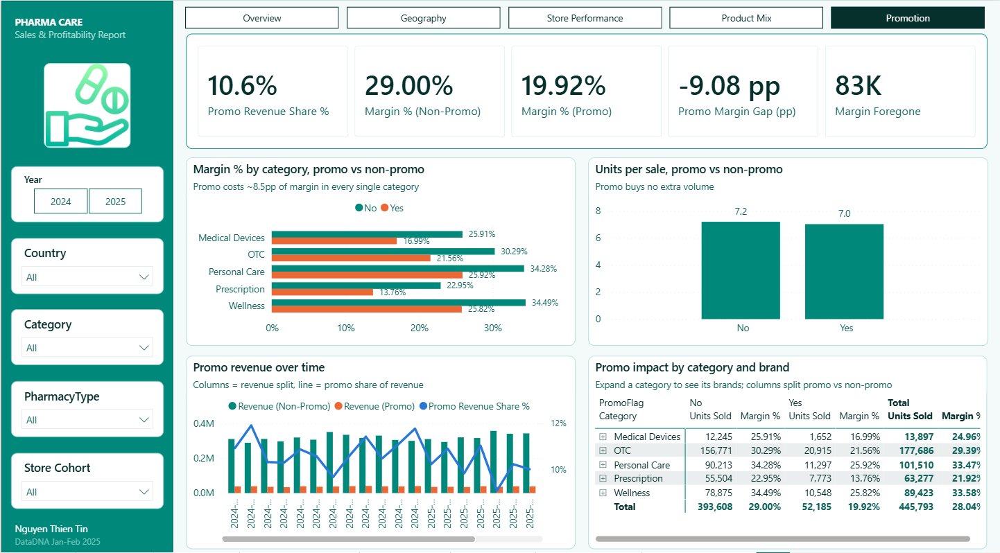

# Pharmacy Sales & Profitability Analysis

A Power BI report over 62,139 daily sales transactions from 120 pharmacies across 8 European countries, covering 220 products over 24 months (2024-2025).

The report is built around one question: **where does margin actually come from?** The answer is nowhere near where revenue comes from. Revenue is a geography story. Margin is not - it lives entirely in product mix and promotional pricing, and the five pages are sequenced to prove that.

> **This dataset was created for the Onyx Data DNA challenge and does not reflect real pharmacy operations.** Every figure below comes from a modelling exercise. Read [Data Limits and Assumptions](#3-data-limits-and-assumptions) before treating any of it as a business KPI - in particular the margin *rate* in this data is effectively a constant across geography, which changes what the geographic pages can and cannot tell you.

> **In a hurry?** [`docs/KEY_FINDINGS.md`](docs/KEY_FINDINGS.md) condenses the data limits and every insight below onto one screen.

> **Working notes:** [`docs/business-questions-to-visuals.md`](docs/business-questions-to-visuals.md) maps each challenge question to the visuals that answer it. [`docs/DAX_DOCUMENTATION.md`](docs/DAX_DOCUMENTATION.md) documents the model, every calculated column and all 47 measures.

<!--  -->

---

## 1. Business Problem and Objectives

Understand how sales and profitability vary across a European pharmacy distribution network, and quantify which levers actually move margin.

* **Primary objective:** locate the levers that move margin, and put a number on each.
* **Core objectives:**
  * **Geographic performance** - how revenue and margin distribute across country -> region -> city -> pharmacy, and whether any market is structurally more profitable.
  * **Store benchmarking** - compare each pharmacy against peers *in its own region*, on a basis not distorted by store age or store size.
  * **Product & promotion economics** - which categories and brands generate revenue versus margin, which products are high-volume/low-margin, and whether promotional pricing pays for itself.
* **Data source:** [Onyx Data DNA Challenge (Jan-Feb 2025)](https://onyxdata.co.uk/data-dna-dataset-challenge/)

---

## 2. Dataset & Architecture

Star schema: three dimensions around one sales fact. Power Query reads the workbook in [`data/`](data/) directly from this repository over HTTPS, so **Refresh works without editing a single path**.

| Table | Source sheet | Rows | Grain |
|---|---|---|---|
| **FactSales** | `T_FactSales` | 62,139 | one row per pharmacy x product x day |
| **DimPharmacy** | `T_DimPharmacy` | 120 | one row per pharmacy |
| **DimProduct** | `T_DimProduct` | 220 | one row per product |
| **DimDate** | `T_DimDate` | 731 | one row per day, 2024-01-01 -> 2025-12-31 |

### 2.1 Data model relationships

Three relationships, all single-direction one-to-many from dimension to fact: `DimDate[DateKey]`, `DimPharmacy[PharmacyID]` and `DimProduct[ProductID]` each filter `FactSales`. No bidirectional filters and no inactive relationships, so every measure resolves in one predictable direction.

`DimDate` is marked as a date table with Auto date/time off, which keeps time intelligence on one authoritative calendar. Three hierarchies sit on the dimensions - Geography (Country -> Region -> City -> Pharmacy), Product (Category -> Brand -> Product) and Calendar (Year -> Quarter -> Month) - and all 47 measures live in a separate `_Measures` table.



> Column definitions, the six calculated columns and every measure are documented in [`docs/DAX_DOCUMENTATION.md`](docs/DAX_DOCUMENTATION.md).

---

## 3. Data Limits and Assumptions

This file was generated for a challenge, and four of its properties are provable from the raw workbook itself. Each is stated here because it changes what Section 4 is allowed to claim.

**1. Margin % is locked at ~28% across every geography, because cost carries the same country index as price.**
Average unit price runs EUR 15.20 in Poland to EUR 21.41 in the Netherlands, a **1.41x** spread. Margin % across those same eight countries moves only 27.84%-28.16%, a spread of **0.33pp**. Across 38 regions it is 0.91pp, across Urban / Suburban / Rural 0.12pp, across S / M / L store sizes 0.03pp. Recomputed from the raw file, each country's cost index divided by its price index lands at 0.9571-0.9589 - constant to within 0.2% across all eight. Real pharmacy chains vary widely by country because reimbursement regimes and price regulation differ.
*Consequence:* the geographic pages answer "who is big", not "who is efficient". The report says so explicitly rather than manufacturing a difference, and it deliberately avoids colour-scaling any map or heat map by `Margin %`, because auto-scaling a 0.33pp spread renders as eight distinct colours and invents a pattern that does not exist.


**2. Margin only moves with product mix, and the mix is cloned into every market.**
Category margin rates are identical country to country: Prescription lands at 21.75%-22.04% everywhere, OTC at 29.27%-29.47%, Wellness at 33.48%-33.81%. The mix itself is just as uniform - Prescription is 30.8%-33.7% of revenue in all 8 countries, OTC 20.1%-21.5%, Wellness 19.2%-21.2%. The same holds across store types (Prescription 31.7% / 32.5% / 32.6% for Rural / Suburban / Urban), and an average store sells 183.5 of the 220 products, so mix cannot differ store to store either.
*Consequence:* every margin claim in Section 4 is read at category and product level. Cuts that look like margin drivers but are really category in disguise - brand, generic versus branded - are flagged where they appear.


**3. `PromoFlag` is a random row flag with no volume response.**
Promotion is 10.16%-11.73% of revenue in every country and 11.6%-12.4% of rows in every store size band, on weekdays and weekends alike - blanket application, not targeting. Average price falls in all five categories while units per transaction barely moves, and four of the five sell *fewer* on promotion: Personal Care 9.22 to 8.77, OTC 9.17 to 9.03, Wellness 7.18 to 7.07, Medical Devices 2.30 to 2.26, only Prescription edging up 4.82 to 4.84. Compared like for like inside the same product, promo rows average **0.97x** the units of non-promo rows across all 220 products.
*Consequence:* Page 5 sizes the give-away. It does not measure campaign effectiveness, and the absence of uplift is a property of the generator rather than a marketing failure.

<!--  -->
<!-- Capture: Promotion page, *Units per sale, promo vs non-promo* -->

**4. Eleven of 120 stores opened inside the observation window, so raw revenue ranks store age and store size.**
Vienna HealthPoint #115 opened 2025-12-13 and traded **10 days**. On raw `Total Revenue` the network spreads **102.6x**. Across the 109 established stores on revenue per trading day it spreads **3.33x** - EUR 94.75 to EUR 315.80. Even that residue is not performance: sorted by revenue per trading day, the top eight established stores are all `StoreSizeBand = L` and the bottom eight are all `S`.
*Consequence:* every store comparison uses the normalised basis, with a `Store Cohort` slicer on each page, and `StoreSizeBand` sits in the league table so size can be read alongside the ranking.

<!--  -->
<!-- Capture: Store Performance page, *Store league table* sorted by Revenue per Active Day, StoreSizeBand column visible -->

Minor notes: `DiscontinuedDate` is blank for 185 of 220 products, `OpenDate` reaches back to 2010 while the fact table covers only 2024-2025, and the source `DimDate` ships no day-of-week column - `DayName` and `DayType` are derived in the model, which is what makes Insight 4.4 visible at all.

---

## 4. Executive Summary & Key Insights

EUR 8,633,977 revenue, EUR 2,421,141 margin, a **28.04%** margin rate, 445,793 units, 120 pharmacies, 731 days. Revenue grew **+4.43%** from 2024 to 2025 with the margin rate essentially unchanged (27.97% to 28.11%, **+0.13pp**).

Four findings survive the four limits above. Each names the page and visual it comes from.

### 4.1 Margin comes from the product mix, and nowhere else

| Category | Revenue | % of revenue | Margin % | Avg price |
|---|---|---|---|---|
| Prescription | EUR 2,797,016 | 32.4% | **21.92%** | EUR 44.20 |
| OTC | EUR 1,797,330 | 20.8% | 29.39% | EUR 10.12 |
| Wellness | EUR 1,712,457 | 19.8% | **33.58%** | EUR 19.15 |
| Personal Care | EUR 1,454,603 | 16.9% | **33.47%** | EUR 14.33 |
| Medical Devices | EUR 872,572 | 10.1% | **24.96%** | EUR 62.79 |

* The largest revenue line is the least profitable: **11.66pp** from Prescription to Wellness. At product level the spread is wider still, 17.48%-38.83% across 220 products.
* Brands appear to spread **20.37%-35.31%** across 32, but that is category in disguise - the four highest-margin brands are all Wellness or Personal Care, the four lowest all Prescription or Medical Devices. AntiBioX leads revenue (EUR 726,405) at 23.39%; ZenHealth earns **35.31%** on EUR 285,040, 39% of AntiBioX's revenue at 1.5x the rate.
* The same trap catches generics. Pooled, they run 14.6% of revenue at **25.48%** against **28.48%** branded - a 3pp penalty that vanishes on inspection, because generics exist only in OTC and Prescription. Inside OTC the gap is **-0.33pp**, and inside Prescription generics actually earn **+0.63pp more**.

> **Page 4 - Product Mix:** *Revenue vs margin by category* (the two rankings invert), *Revenue by brand*, *Generic vs branded margin*.

<!--  -->

### 4.2 Promotion costs 9.08pp of margin and buys no volume

| Metric | Non-Promo | Promo | Delta |
|---|---|---|---|
| Revenue | EUR 7,722,676 (89.4%) | EUR 911,301 (10.6%) | - |
| **Margin %** | **29.00%** | **19.92%** | **-9.08pp** |
| Avg unit price | EUR 19.62 | EUR 17.46 | -11.00% |
| **Units per transaction** | **7.195** | **7.023** | **-2.39%** |

* **No volume uplift at all.** Units per transaction is marginally *lower* on promotion, so an 11% discount buys nothing.
* The sacrifice is near-identical in every category: Prescription -9.18pp, Medical Devices -8.92pp, OTC -8.73pp, Wellness -8.67pp, Personal Care -8.36pp.
* **Margin foregone.** The `Margin Foregone` card reads **EUR 82,709**, computed as promo revenue valued at the non-promo margin rate. That counterfactual holds revenue constant and lifts the rate. Valuing the same rows at full list price instead - the correct comparison, since `CostEUR` is unaffected by the flag - puts the actual give-away at **EUR 130,336**, about **EUR 65,168/year** or **5.4%** of total margin. *(See limitation 3: in this dataset the absence of uplift is a generator property, so treat the figure as a demonstration of method.)*

> **Page 5 - Promotion:** *Margin % by category, promo vs non-promo*, *Units per sale, promo vs non-promo*, KPI cards.

<!--  -->

### 4.3 Scale explains the network; efficiency explains nothing

* Germany 18.2%, France 16.3% and Italy 15.4% carry **49.9%** of revenue - on exactly **50.0%** of the stores, 60 of 120. Across the eight countries, store count and revenue correlate at **r = 0.91**. The top 10 of 38 regions carry 46.9%, on the same logic.
* Profitability does not vary with any of it: all 8 countries land between **27.84%** and **28.16%** margin.
* Store rankings tell the same story. Raw revenue spreads **102.6x**, revenue per trading day **3.33x**, and what is left tracks `StoreSizeBand` - L stores average EUR 126,898 against S at EUR 38,713, a **3.28x** spread at identical margin.
* Format drives volume only: Urban EUR 82,506 per store, Suburban EUR 66,155, Rural EUR 60,843, all three at 27.98%-28.11% margin.

> **Page 2 - Geography:** *Country and region scorecard* puts `Revenue Contribution %`, `Active Pharmacies` and `Margin %` in one matrix - contribution tracks store count, margin does not move. **Page 3 - Store Performance:** *Store league table*, *Revenue per store by location type*.

<!--  -->

### 4.4 The weekday/weekend split is the strongest time signal in the data

* Weekdays earn **EUR 12,471/day** against weekends **EUR 10,153/day**, an **18.6%** gap. Monday peaks at EUR 12,681, Sunday troughs at EUR 10,007.
* It is footfall, not basket. Transactions per day fall from 89.8 to 73.0 (**-18.7%**) while revenue per transaction holds at EUR 138.91 against EUR 139.07 and units per transaction at 7.16 against 7.21. Adding `Units per Sale` to the weekday chart makes this visible in one line: it flatlines while revenue drops.
* Larger than the entire month-to-month spread. Once day counts and store openings are held constant, the twelve monthly indices sit inside **0.97-1.05** and margin % varies **0.41pp** across the year - February only looks weak because it has 57 trading days to January's and March's 62, and per day it out-earns both.
* The signal was invisible in the source until `DayName` and `DayType` were derived.

> **Page 1 - Overview:** *Avg Daily Revenue by DayName and DayType*, *Avg Daily Revenue by MonthName and Year*.

<!--  -->

---
## 5. Actionable Recommendations

1. **Stop untargeted promotion, approximately EUR 65,168/year.** The flag is spread evenly across every country, store type and category and buys no incremental volume, so withdrawing it recovers the full discount rather than trading margin for lost sales. *(See limitation 3: in this dataset the absence of uplift is a generator property, so read the figure as a demonstration of method.)*
2. **If promotion continues, restrict it to Wellness and Personal Care.** Their 33.5% base margin absorbs a 9pp discount, the same discount on Prescription (21.92% base) consumes 42% of the product's profit.
3. **Shift mix toward Wellness and Personal Care, approximately EUR 25,168/year.** Moving 5 percentage points of revenue out of Prescription into Wellness captures the 11.66pp gap, worth EUR 50,336 across the two-year window.
4. **Reconsider weekend staffing and hours.** Weekends run 18.6% below weekdays on transaction count alone, with basket value unchanged - a wider gap than the entire 8.1% month-to-month spread.
5. **Do not treat any country or store format as a turnaround case.** The five weakest stores per trading day are Polish, but Poland's shortfall is its price index rather than its trading: unit prices run 22% below France while units per trading day are marginally *higher*, 10.15 against 10.00. Priced neutrally the eight markets sit within **1.14x** of each other, and margin is identical across every country, region, format and size band. The levers here are 1 to 3, all of them mix.

---

## 6. Dashboard Overview

Five report pages, a fixed 220px navigation rail carrying five slicers (`Year`, `Country`, `Category`, `PharmacyType`, `Store Cohort`), and a page navigator across the top of every page. Two exploratory *Data Mining* pages remain in the file but are hidden from view mode.

### Page 1 - Overview
KPI row, revenue and margin trend with `Margin %` on a fixed axis, day-count-normalised seasonality, the weekday/weekend rhythm, a 2024 to 2025 waterfall broken down by country, and revenue composition over time.



### Page 2 - Geography
Azure Maps bubble layer over all 120 stores, a Pareto of the 38 regions against cumulative revenue share, revenue by country, a Country -> Region -> City -> Pharmacy drill-down, and the *Country and region scorecard* matrix that carries `Revenue Contribution %`, `Active Pharmacies` and `Margin %` side by side - contribution tracks store count, margin does not move.

> The deliberate "margin is flat everywhere" bar chart behind limitation 1 currently sits on the hidden *Data Mining* page rather than here.

> The Azure Maps visual needs two tenant switches under **Admin portal -> Tenant settings -> Integration settings**: *Users can use the Azure Maps visual*, and, for tenants outside the US/EU, *Data sent to Azure Maps can be processed outside your tenant's geographic region, compliance boundary, or national cloud instance*, which is **disabled by default**.



### Page 3 - Store Performance
Peer scatter on revenue per trading day against margin, the laggard bar chart, margin gap against each store's own region, a league table ranked within region, and the Urban/Suburban/Rural comparison.



### Page 4 - Product Mix
Four-quadrant scatter of all 220 products, revenue against margin by category, brand ranking, generic versus branded, and the product action list.



### Page 5 - Promotion
Promo KPI row including margin foregone, the per-category margin gap, the units-per-sale evidence that no volume uplift exists, promo share over time, and a category to brand promo matrix.



---

## 7. Key DAX Logic

Peer comparison is the analytical core. A store is judged against stores in its own region, per trading day, so regional scale does not distort the ranking and - with the `Store Cohort` slicer applied - neither does store age. `ALLEXCEPT` clears the current store's own filters while keeping the region it belongs to, which turns a per-store measure into a per-region peer set.

```dax
Rank in Region =
RANKX(
    CALCULATETABLE(
        VALUES( DimPharmacy[PharmacyName] ),
        ALLEXCEPT( DimPharmacy, DimPharmacy[Country], DimPharmacy[Region] )
    ),
    [Revenue per Active Day], , DESC, DENSE
)
```

This one measure is what turns a 102.6x raw revenue spread, which mostly ranks store age, into a 3.33x like-for-like comparison within each region. It does not clear `StoreSizeBand`, which is why limitation 4 matters and why the league table carries the size band as a visible column: dividing `Revenue per Active Day` by its own band average collapses the remaining spread to **1.40x**, and at that point no country is a laggard.

> All 47 measures, the six calculated columns and the model conventions behind them are documented in [`docs/DAX_DOCUMENTATION.md`](docs/DAX_DOCUMENTATION.md).

---

## 8. Repository Structure

```
├── assets/   # Dashboard and chart screenshots, model diagram
├── data/     # Source workbook, read over HTTPS by Power Query
├── docs/     # Challenge brief, business-question map, DAX documentation
├── powerbi/  # Power BI project source: .pbip, report layout & semantic model
└── README.md
```

**To open the report:** launch `powerbi/TinNguyen_Jan_Feb2025_Challenge.pbip` in Power BI Desktop, then **Refresh** - the derived calendar columns populate on refresh.

---

## 9. Acknowledgments & References

* **Challenge host:** [Onyx Data DNA Dataset Challenge](https://onyxdata.co.uk/data-dna-dataset-challenge/)
* **Mini challenge:** ZoomCharts Drill Down visuals - see [`docs/`](docs/)
